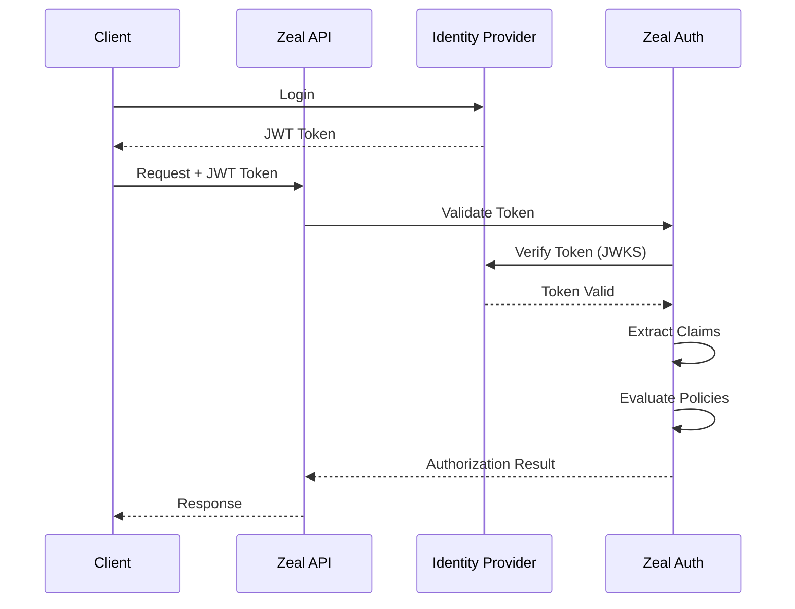

# Zeal Authorization Integration Guide

This guide explains how to integrate and use the Zeal authorization framework with your external identity provider.

## Overview

Zeal's authorization framework provides:
- **Token Validation**: Validates JWT tokens from any identity provider
- **Policy-Based Authorization**: Fine-grained access control using YAML policies
- **Claim Mapping**: Flexible mapping of JWT claims to authorization attributes
- **Multi-Tenancy**: Built-in tenant isolation and organization hierarchies
- **Development Mode**: Mock auth for local development

## Quick Start

### 1. Configure Your Identity Provider

Copy the example environment file and configure your identity provider:

```bash
cp .env.auth.example .env.local
```

Edit `.env.local` with your identity provider settings:

```env
# Enable authorization
ZEAL_AUTH_ENABLED=true
ZEAL_AUTH_MODE=production

# Your identity provider JWT settings
AUTH_JWT_ISSUER=https://your-identity-provider.com
AUTH_JWT_AUDIENCE=https://api.your-app.com
AUTH_JWT_JWKS_URI=https://your-identity-provider.com/.well-known/jwks.json

# Map JWT claims to Zeal's model
AUTH_CLAIM_SUBJECT_ID=sub
AUTH_CLAIM_TENANT=tenant_id
AUTH_CLAIM_ORGANIZATION=org_id
AUTH_CLAIM_ROLES=roles
AUTH_CLAIM_PERMISSIONS=permissions
```

### 2. Define Authorization Policies

Copy and customize the authorization policies:

```bash
cp auth-policies.example.yaml auth-policies.yaml
```

Example policy:

```yaml
policies:
  - id: workflow-owner-access
    description: "Workflow owners have full access"
    priority: 100
    effect: allow
    resources:
      - type: workflow
        conditions:
          - attribute: owner
            operator: equals
            value: "${subject.id}"
    actions: ["*"]
```

### 3. Initialize Auth in Your App

In your app initialization (e.g., `app/layout.tsx` or `middleware.ts`):

```typescript
import { initializeAuth } from '@/lib/auth';

// Initialize on server startup
initializeAuth().catch(console.error);
```

### 4. Protect Your API Routes

Use the `withAuth` middleware to protect routes:

```typescript
// app/api/workflows/route.ts
import { withAuth } from '@/lib/auth/middleware';

export const GET = withAuth(
  async (req) => {
    // req.auth contains the authenticated user context
    const userId = req.auth?.subject.id;
    
    // Your business logic here
    const workflows = await getWorkflows(userId);
    return NextResponse.json(workflows);
  }
);
```

## Authentication Flow



## Common Integration Patterns

### Basic Authentication Check

```typescript
export const GET = withAuth(
  async (req) => {
    // Automatically returns 401 if not authenticated
    return NextResponse.json({ user: req.auth?.subject });
  }
);
```

### Role-Based Access

```typescript
import { requireRole } from '@/lib/auth/middleware';

export const GET = withAuth(
  composeMiddleware(
    requireRole('admin'),
    async (req) => {
      // Only admins can access
      return NextResponse.json(await getAdminData());
    }
  )
);
```

### Resource-Based Authorization

```typescript
export const PUT = withAuth(
  async (req) => {
    const workflowId = req.params.id;
    // Authorization checked against policies
    return updateWorkflow(workflowId, await req.json());
  },
  {
    resource: (req) => ({
      type: 'workflow',
      id: req.params.id
    }),
    action: 'update'
  }
);
```

### Multi-Tenant Isolation

```typescript
import { withTenantIsolation } from '@/lib/auth/middleware';

export const GET = withAuth(
  async (req) => {
    const allData = await getData();
    // Automatically filters by tenant
    const tenantData = withTenantIsolation(allData, req);
    return NextResponse.json(tenantData);
  }
);
```

## Development Mode

For local development without an identity provider:

```env
ZEAL_AUTH_ENABLED=true
ZEAL_AUTH_MODE=development

# Mock user configuration
ZEAL_DEV_USER_ID=dev-user
ZEAL_DEV_TENANT_ID=dev-tenant
ZEAL_DEV_ORG_ID=dev-org
ZEAL_DEV_ROLES=user,developer
ZEAL_DEV_PERMISSIONS=workflows.read,workflows.create

# Allow all requests (bypass policies)
ZEAL_DEV_ALLOW_ALL=true
```

## Claim Mapping

Map claims from your identity provider to Zeal's authorization model:

### Standard Claims

```env
# User identification
AUTH_CLAIM_SUBJECT_ID=sub
AUTH_CLAIM_EMAIL=email
AUTH_CLAIM_NAME=name

# Organization structure
AUTH_CLAIM_TENANT=tenant_id
AUTH_CLAIM_ORGANIZATION=org_id
AUTH_CLAIM_TEAMS=teams
AUTH_CLAIM_GROUPS=groups

# Permissions
AUTH_CLAIM_ROLES=roles
AUTH_CLAIM_PERMISSIONS=permissions
```

### Custom Claims

Map custom claims for Zeal-specific features:

```env
# Workflow limits
AUTH_CLAIM_WORKFLOW_QUOTA=limits.workflows
AUTH_CLAIM_EXECUTION_QUOTA=limits.executions

# Node template access
AUTH_CLAIM_ALLOWED_NODE_TYPES=nodeTemplate.allowedTypes

# Compliance
AUTH_CLAIM_COMPLIANCE_LEVEL=kyc.level
```

## Policy Configuration

### Policy Structure

```yaml
policies:
  - id: unique-policy-id
    description: "Human-readable description"
    priority: 100  # Higher priority evaluated first
    effect: allow | deny | filter
    
    # Resources this policy applies to
    resources:
      - type: workflow | node_template | orchestrator
        conditions:
          - attribute: owner
            operator: equals | not_equals | in | contains
            value: "${subject.id}"  # Can use subject attributes
    
    # Actions allowed/denied
    actions: ["read", "create", "update", "delete"]
    
    # Subject conditions
    subjects:
      conditions:
        - claim: roles
          operator: contains
          value: "admin"
    
    # Additional conditions
    conditions:
      - type: time | quota | ip
        # Type-specific configuration
    
    # Post-authorization obligations
    obligations:
      - type: audit | notify
        # Obligation configuration
```

### Common Policy Patterns

#### Owner Access
```yaml
- id: owner-full-access
  effect: allow
  resources:
    - type: workflow
      conditions:
        - attribute: owner
          operator: equals
          value: "${subject.id}"
  actions: ["*"]
```

#### Read-Only for Organization
```yaml
- id: org-read-access
  effect: allow
  resources:
    - type: workflow
      conditions:
        - attribute: organizationId
          operator: equals
          value: "${subject.organizationId}"
  actions: ["read"]
```

#### Premium Feature Gate
```yaml
- id: premium-features
  effect: allow
  resources:
    - type: node_template
      conditions:
        - attribute: tier
          operator: equals
          value: "premium"
  actions: ["use"]
  subjects:
    conditions:
      - claim: planTier
        operator: in
        values: ["premium", "enterprise"]
```

## Troubleshooting

### Token Not Found

```typescript
// Check headers are being passed correctly
const token = req.headers.get('authorization')?.replace('Bearer ', '');
```

### Policy Not Matching

Enable debug logging:

```env
ZEAL_AUTH_DEBUG=true
```

Check policy evaluation:

```typescript
const result = await auth.authorize(token, resource, action);
console.log('Auth result:', result);
console.log('Matched policies:', result.matchedPolicies);
```

### Claims Not Mapped

Verify claim paths in your JWT:

```typescript
const claims = jwt.decode(token);
console.log('JWT claims:', claims);
```

## Security Best Practices

1. **Always use HTTPS** in production
2. **Validate token expiration** with appropriate clock tolerance
3. **Use JWKS rotation** for key management
4. **Implement rate limiting** on auth endpoints
5. **Audit sensitive operations** using policy obligations
6. **Use least-privilege principle** in policies
7. **Test policies thoroughly** before production

## API Reference

### Middleware Functions

- `withAuth(handler, options?)` - Main authorization middleware
- `requireRole(...roles)` - Require specific roles
- `requirePermission(...permissions)` - Require specific permissions
- `withTenantIsolation(data, req)` - Apply tenant filtering
- `applyFieldConstraints(data, constraints)` - Apply field-level access control
- `composeMiddleware(...middlewares)` - Chain multiple middlewares

### Configuration Functions

- `initializeAuth()` - Initialize the auth framework
- `getAuth()` - Get auth instance
- `extractToken(req)` - Extract token from request
- `shouldBypassAuth(pathname)` - Check if path should skip auth

## Support

For issues or questions:
- Check the [example implementations](./examples/auth-integration-example.ts)
- Review the [policy examples](./auth-policies.example.yaml)
- Consult your identity provider's documentation for claim structure