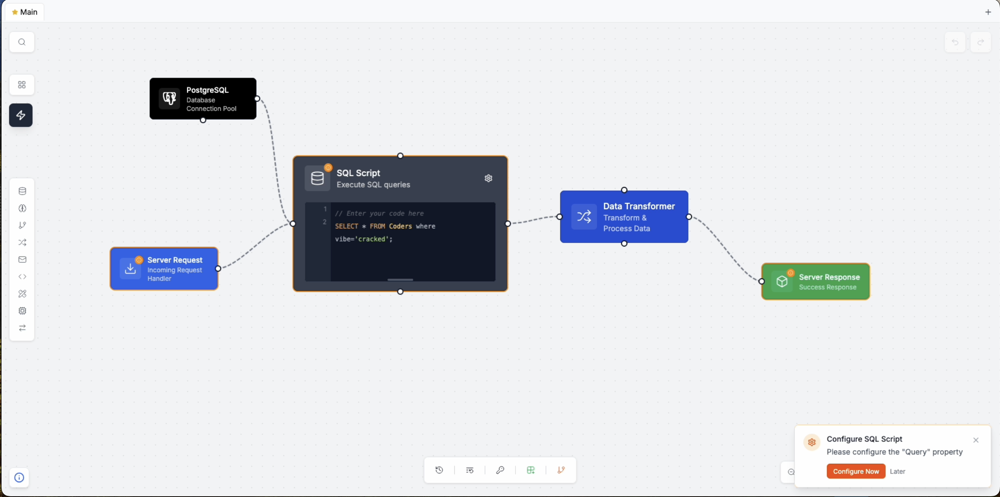

# Zeal - Visual Workflow Editor

A modern, real-time collaborative workflow editor with node-based visual programming, built with Next.js, TypeScript, and CRDT synchronization.



## 🚀 Quick Start

### Using Docker (Recommended)

#### Development

```bash
# Clone the repository
git clone https://github.com/offbit-ai/zeal.git
cd zeal

# Copy environment variables
cp .env.example .env

# Generate a secure secret for NextAuth
openssl rand -base64 32

# Start all services
docker-compose up -d

# View logs
docker-compose logs -f
```

#### Production

```bash
# Clone the repository
git clone https://github.com/offbit-ai/zeal.git
cd zeal

# Copy environment variables
cp .env.example .env

# Generate a secure secret for NextAuth
openssl rand -base64 32

# Start all services in production mode
./docker-compose-prod.sh up

# View logs
./docker-compose-prod.sh logs -f
```

The application will be available at:
- Web UI: http://localhost:3000
- CRDT Server: ws://localhost:8080
- PostgreSQL: localhost:5432
- Redis: localhost:6379

### Manual Installation

```bash
# Install dependencies
npm install

# Build Rust CRDT server
cd crdt-server
cargo build --release
cd ..

# Setup database
createdb zeal_db
psql zeal_db < init.sql

# Start development servers
npm run dev
```

## 📋 Features

- **Visual Workflow Editor**: Drag-and-drop node-based interface
- **Real-time Collaboration**: Multiple users can edit simultaneously with CRDT sync
- **Node Groups**: Organize nodes into collapsible groups
- **Version History**: Track all changes with rollback to published versions
- **Execution Replay**: Review past workflow executions with recorded data flow*
- **Flow Tracing**: Examine execution logs and data flow through nodes*
- **Analytics**: Performance metrics, error tracking, and usage trends
- **Node Repository**: Extensible library of 50+ node types
- **Subgraphs**: Create reusable workflow components
- **Auto-save**: Changes are automatically persisted every 30 seconds
- **Export/Import**: Share workflows as JSON files
- **Snapshot Management**: Create named checkpoints at milestones

*Note: History browsing and flow tracing features depend on workflow execution data being recorded by your runtime engine implementation.

## 🏗️ Architecture

See [ARCHITECTURE.md](docs/ARCHITECTURE.md) for detailed system design.

### Tech Stack

- **Frontend**: Next.js 14, React 18, TypeScript, Tailwind CSS
- **Backend**: Node.js, Rust (CRDT server)
- **Database**: PostgreSQL, Redis
- **Real-time**: Socket.IO, Yjs CRDT
- **Deployment**: Docker, Docker Compose

## ⚠️ Implementation Notes

This project provides a visual workflow editor interface and collaboration infrastructure. The following components are **not included** and must be implemented by users:

### 1. **Workflow Runtime Engine**
The actual execution of workflows is not implemented. You will need to:
- Build or integrate a workflow execution engine
- Implement node execution logic for each node type
- Handle data flow between nodes
- Manage execution state and error handling
- Record execution history for the replay features

### 2. **User Management & Authentication**
While the editor supports multi-user collaboration, user management is not included:
- User registration and login systems
- Role-based access control (RBAC)
- Team/organization management
- API authentication beyond basic NextAuth setup
- User profile management

### 3. **Production Deployment Considerations**
- Scaling strategy for the CRDT server
- Database backup and recovery procedures
- Security hardening and SSL/TLS configuration
- Monitoring and alerting infrastructure
- Rate limiting and abuse prevention

## 🔧 Configuration

### Environment Variables

| Variable | Description | Default |
|----------|-------------|---------|
| `DATABASE_URL` | PostgreSQL connection string | Required |
| `REDIS_URL` | Redis connection string | Required |
| `NEXT_PUBLIC_CRDT_SERVER_URL` | CRDT server WebSocket URL | ws://localhost:8080 |
| `NEXTAUTH_SECRET` | NextAuth.js secret key | Required |
| `NEXTAUTH_URL` | Application URL | http://localhost:3000 |
| `NEXT_PUBLIC_DISABLE_CONSOLE_LOGS` | Disable console logs in production | false |

See `.env.example` for all configuration options.

### Production Deployment

The production deployment script (`docker-compose-prod.sh`) automatically:
- Builds optimized production images
- Enables console log suppression
- Configures proper health checks
- Sets production environment variables

## 📚 Documentation

- [Architecture Overview](docs/ARCHITECTURE.md)
- [Workflow Editor Guide](docs/WORKFLOW_EDITOR.md)
- [Node Template Reference](docs/NODE_TEMPLATES_REFERENCE.md)
- [API Documentation](docs/API.md)
- [Deployment Guide](docs/DEPLOYMENT.md)

## 🤝 Contributing

We welcome contributions! Please see [CONTRIBUTING.md](CONTRIBUTING.md) for guidelines.

## 📄 License

This project is licensed under the Apache License 2.0 - see [LICENSE](LICENSE) for details.

## 🙏 Acknowledgments

- Built with [Yjs](https://yjs.dev/) for CRDT synchronization
- UI components from [Tailwind CSS](https://tailwindcss.com/)
- Icons from [Lucide](https://lucide.dev/)
