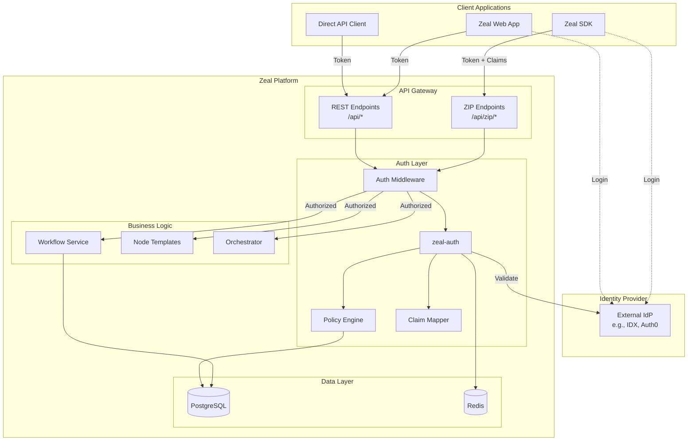

# Zeal Authorization Architecture

## Overview

Zeal uses a unified authorization system (`zeal-auth`) that protects both:
- **SDK endpoints** (ZIP protocol) - Used by Zeal SDK clients
- **Regular API endpoints** - Used by the Zeal web application

The authorization system validates tokens from external identity providers and enforces fine-grained access control through policy evaluation.

## Architecture Flow



## Integration Points

### 1. SDK Integration (ZIP Protocol)

The SDK collects authentication tokens and claims from the client application and passes them with each request:

```typescript
// SDK Client Side
const sdkClient = new ZealSDK({
  token: userToken, // From your identity provider
  sdkVersion: '1.0.0',
  applicationId: 'my-app'
});

// SDK automatically attaches auth context to ZIP requests
const workflow = await sdkClient.workflows.create({
  name: 'My Workflow',
  // ... workflow data
});
```

**Server Side (ZIP Endpoint):**

```typescript
// app/api/zip/orchestrator/workflows/route.ts
import { withZIPAuthorization, getAuthenticatedUserId } from '@/lib/auth/zip-middleware'

export const POST = withZIPAuthorization(
  async (request: NextRequest) => {
    // Authorization already checked by middleware
    const userId = getAuthenticatedUserId(request); // Gets authenticated user
    
    // Business logic with authenticated context
    const workflow = await WorkflowDatabase.createWorkflow({
      userId, // Authenticated user ID
      // ... other data
    });
    
    return NextResponse.json(workflow);
  },
  {
    resourceType: 'workflow',
    action: 'create'
  }
);
```

### 2. Web Application Integration (REST API)

The web application sends tokens via standard Authorization headers:

```typescript
// Client Side
fetch('/api/workflows', {
  headers: {
    'Authorization': `Bearer ${token}`
  }
});
```

**Server Side (REST Endpoint):**

```typescript
// app/api/workflows/route.ts
import { withAuth } from '@/lib/auth/middleware'

export const GET = withAuth(
  async (req: AuthenticatedRequest) => {
    // req.auth contains authenticated user context
    const userId = req.auth?.subject.id;
    
    const workflows = await WorkflowDatabase.listWorkflows({
      userId,
      // Apply tenant isolation automatically
      tenantId: req.auth?.subject.tenantId
    });
    
    return NextResponse.json(workflows);
  },
  {
    resource: 'workflow',
    action: 'read'
  }
);
```

## Authorization Flow

### 1. Token Extraction
- **REST**: From `Authorization: Bearer <token>` header
- **ZIP**: From request body `auth.token` field or Authorization header
- **Cookies**: Fallback to `token` cookie if present

### 2. Token Validation
```typescript
// Automatic token validation against identity provider
const subject = await auth.contextBuilder.extractSubject(token);
// Validates signature, expiry, issuer, audience
```

### 3. Claim Mapping
Maps identity provider claims to Zeal's authorization model:

```env
# Environment configuration
AUTH_CLAIM_SUBJECT_ID=sub
AUTH_CLAIM_TENANT=tenant_id
AUTH_CLAIM_ORGANIZATION=org_id
AUTH_CLAIM_ROLES=roles
AUTH_CLAIM_PERMISSIONS=permissions
```

### 4. Resource Loading
For existing resources, attributes are loaded from the database:

```typescript
// Automatic resource attribute loading
const resource = {
  type: 'workflow',
  id: workflowId,
  attributes: {
    owner: workflow.userId,
    organizationId: workflow.organizationId,
    visibility: workflow.visibility
  }
};
```

### 5. Policy Evaluation
Policies are evaluated based on:
- Subject (user) attributes
- Resource attributes
- Action being performed
- Context (time, location, etc.)

```yaml
# auth-policies.yaml
policies:
  - id: workflow-owner-access
    effect: allow
    resources:
      - type: workflow
        conditions:
          - attribute: owner
            operator: equals
            value: "${subject.id}"
    actions: ["*"]
```

### 6. Authorization Decision
```typescript
const result = await auth.authorize(subject, resource, action);

if (result.allowed) {
  // Proceed with operation
} else {
  // Return 403 Forbidden with reason
}
```

## Key Components

### ZealAuth Class
Core authorization engine that:
- Validates tokens
- Evaluates policies
- Manages cache
- Handles audit logging

### Middleware Functions

#### `withAuth` (REST APIs)
```typescript
export const GET = withAuth(handler, {
  resource: 'workflow',
  action: 'read'
});
```

#### `withZIPAuthorization` (ZIP Endpoints)
```typescript
export const POST = withZIPAuthorization(handler, {
  resourceType: 'workflow',
  action: 'create'
});
```

### Helper Functions

#### For ZIP Endpoints
- `getAuthenticatedUserId(req)` - Get authenticated user ID
- `getOrganizationId(req)` - Get user's organization
- `hasPermission(req, permission)` - Check specific permission
- `applyTenantFilter(data, req)` - Apply tenant isolation

#### For REST Endpoints
- `req.auth.subject` - Authenticated user object
- `req.auth.result` - Authorization result with constraints
- `withTenantIsolation(data, req)` - Apply tenant filtering
- `applyFieldConstraints(data, constraints)` - Field-level security

## Configuration

### Environment Variables

```env
# Enable authorization
ZEAL_AUTH_ENABLED=true
ZEAL_AUTH_MODE=production

# Identity provider configuration
AUTH_JWT_ISSUER=https://your-idp.com
AUTH_JWT_AUDIENCE=https://api.your-app.com
AUTH_JWT_JWKS_URI=https://your-idp.com/.well-known/jwks.json

# Claim mappings
AUTH_CLAIM_SUBJECT_ID=sub
AUTH_CLAIM_TENANT=tenant_id
AUTH_CLAIM_ORGANIZATION=org_id
AUTH_CLAIM_ROLES=roles

# Policy configuration
ZEAL_AUTH_POLICIES_PATH=./auth-policies.yaml
ZEAL_AUTH_DEFAULT_EFFECT=deny
```

### Policy Configuration

```yaml
# auth-policies.yaml
version: "1.0"

policies:
  # Owner has full access
  - id: owner-access
    effect: allow
    resources:
      - type: workflow
        conditions:
          - attribute: owner
            operator: equals
            value: "${subject.id}"
    actions: ["*"]
  
  # Organization members can read
  - id: org-read-access
    effect: allow
    resources:
      - type: workflow
        conditions:
          - attribute: organizationId
            operator: equals
            value: "${subject.organizationId}"
    actions: ["read"]
```

## Multi-Tenancy

### Automatic Tenant Isolation

All queries are automatically filtered by tenant:

```typescript
// Middleware automatically applies tenant filtering
const workflows = await WorkflowDatabase.listWorkflows({
  userId,
  tenantId: req.auth?.subject.tenantId // Automatic
});
```

### Cross-Tenant Access

Controlled via policies:

```yaml
policies:
  - id: admin-cross-tenant
    effect: allow
    resources:
      - type: "*"
    actions: ["*"]
    subjects:
      conditions:
        - claim: roles
          operator: contains
          value: "super_admin"
```

## Security Features

### 1. Token Security
- JWT signature validation
- Expiry checking
- Issuer/Audience validation
- JWKS key rotation support

### 2. Rate Limiting
Applied through obligations:
```yaml
obligations:
  - type: rate-limit
    limit: 100
    window: 3600
```

### 3. Audit Logging
All access attempts are logged:
```typescript
await auth.audit.log({
  type: 'RESOURCE_ACCESS',
  subject: user,
  resource: workflow,
  action: 'update',
  result: 'allowed'
});
```

### 4. Field-Level Security
Sensitive fields can be filtered:
```typescript
const filtered = applyFieldConstraints(data, {
  fields: ['id', 'name', 'public_data']
  // Removes all other fields
});
```

## Development Mode

For local development without an identity provider:

```env
ZEAL_AUTH_MODE=development
ZEAL_DEV_USER_ID=dev-user
ZEAL_DEV_ROLES=user,developer
ZEAL_DEV_ALLOW_ALL=true
```

## Migration Guide

### Updating Existing Endpoints

1. **Import middleware:**
```typescript
import { withAuth } from '@/lib/auth/middleware'
// or
import { withZIPAuthorization } from '@/lib/auth/zip-middleware'
```

2. **Wrap handler:**
```typescript
// Before
export async function GET(req) { ... }

// After
export const GET = withAuth(
  async (req) { ... },
  { resource: 'workflow', action: 'read' }
);
```

3. **Use authenticated user:**
```typescript
// Before
const userId = 'hardcoded-user';

// After
const userId = req.auth?.subject.id;
```

## Troubleshooting

### Common Issues

1. **Token not found:**
   - Check Authorization header format: `Bearer <token>`
   - For ZIP: Ensure SDK passes auth context

2. **Access denied:**
   - Check policy configuration
   - Verify claim mappings match your IdP
   - Enable debug logging: `ZEAL_AUTH_DEBUG=true`

3. **Tenant isolation issues:**
   - Ensure tenant claim is mapped correctly
   - Verify tenant_id is present in token

### Debug Mode

Enable detailed logging:
```env
ZEAL_AUTH_DEBUG=true
ZEAL_AUTH_AUDIT_ENABLED=true
ZEAL_AUTH_AUDIT_LEVEL=debug
```

## Best Practices

1. **Always use middleware** instead of manual auth checks
2. **Define resources clearly** with proper types and attributes
3. **Use policy files** for complex authorization rules
4. **Cache authorization decisions** for performance
5. **Audit sensitive operations** using obligations
6. **Test policies thoroughly** before production
7. **Use least-privilege principle** in default policies
8. **Implement proper error handling** for auth failures

## Support

For issues or questions:
- Review [auth examples](./examples/auth-integration-example.ts)
- Check [policy examples](./auth-policies.example.yaml)
- Consult [integration guide](./AUTH_INTEGRATION_GUIDE.md)