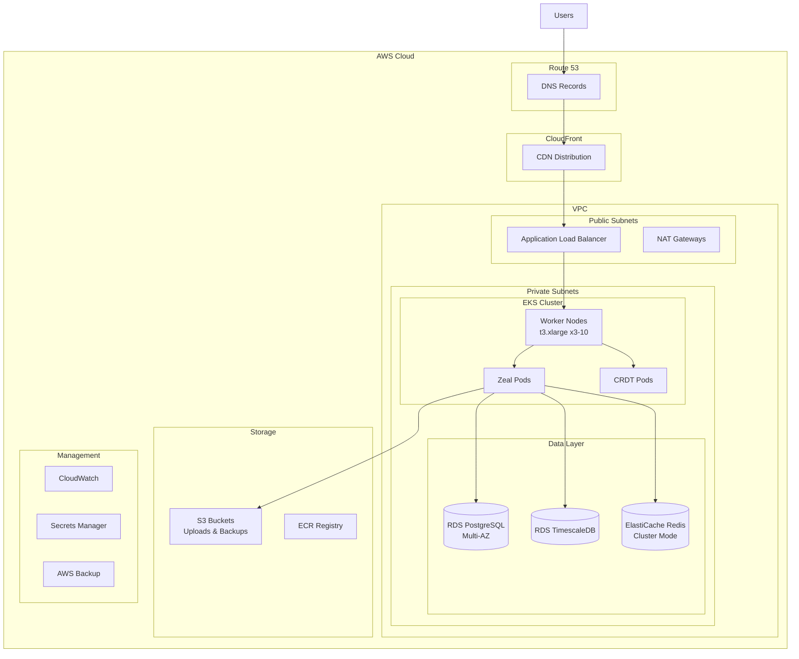

# Zeal AWS EKS Deployment

Enterprise-grade deployment of Zeal on Amazon Web Services using EKS, RDS, ElastiCache, and other AWS managed services.

## Table of Contents

- [Overview](#overview)
- [Architecture](#architecture)
- [Prerequisites](#prerequisites)
- [Quick Start](#quick-start)
- [Detailed Setup](#detailed-setup)
- [Security](#security)
- [Monitoring](#monitoring)
- [Backup & Recovery](#backup--recovery)
- [Scaling](#scaling)
- [Troubleshooting](#troubleshooting)

## Overview

This deployment leverages AWS managed services for a highly available, scalable, and secure Zeal installation:

- **EKS** - Managed Kubernetes for container orchestration
- **RDS PostgreSQL** - Managed database with Multi-AZ support
- **RDS for TimescaleDB** - Time-series database for flow traces
- **ElastiCache Redis** - Managed Redis for caching and pub/sub
- **S3** - Object storage for uploads and backups
- **CloudFront** - CDN for global content delivery
- **Route53** - DNS management
- **ACM** - SSL/TLS certificate management
- **CloudWatch** - Monitoring and logging
- **AWS Backup** - Automated backup solution

## Architecture



## Prerequisites

### Required Tools

- AWS CLI v2.x
- kubectl v1.28+
- eksctl v0.165+
- Terraform v1.5+
- Helm v3.12+
- Docker

### AWS Account Setup

1. **IAM Permissions**: Ensure your AWS user has permissions for:
   - EKS cluster creation
   - VPC and networking
   - RDS and ElastiCache
   - S3 and ECR
   - IAM role creation
   - Route53 and ACM

2. **Service Quotas**: Verify you have sufficient quotas for:
   - EC2 instances (minimum 6 for HA setup)
   - Elastic IPs (minimum 3)
   - RDS instances (2)
   - ElastiCache nodes

3. **Configure AWS CLI**:
```bash
aws configure
# Enter your AWS Access Key ID, Secret Access Key, and preferred region
```

## Quick Start

1. **Clone the repository**:
```bash
git clone https://github.com/offbit-ai/zeal.git
cd zeal/deployments/aws
```

2. **Configure deployment**:
```bash
# Copy and edit configuration
cp terraform/terraform.tfvars.example terraform/terraform.tfvars
vim terraform/terraform.tfvars
```

3. **Run deployment**:
```bash
# Set environment variables
export CLUSTER_NAME=zeal-production
export AWS_REGION=us-east-1
export DOMAIN=zeal.example.com

# Run deployment script
./deploy.sh
```

## Detailed Setup

### Step 1: Infrastructure Setup with Terraform

```bash
cd terraform

# Initialize Terraform
terraform init

# Review the deployment plan
terraform plan

# Apply infrastructure
terraform apply
```

This creates:
- VPC with public/private subnets across 3 AZs
- RDS PostgreSQL with Multi-AZ
- RDS for TimescaleDB
- ElastiCache Redis cluster
- S3 buckets
- ECR repository
- Security groups and IAM roles

### Step 2: EKS Cluster Creation

```bash
# Create EKS cluster
eksctl create cluster \
  --name zeal-production \
  --region us-east-1 \
  --nodegroup-name workers \
  --node-type t3.xlarge \
  --nodes 3 \
  --nodes-min 2 \
  --nodes-max 10 \
  --managed

# Update kubeconfig
aws eks update-kubeconfig --name zeal-production --region us-east-1
```

### Step 3: Install AWS Controllers

```bash
# Install AWS Load Balancer Controller
kubectl apply -k "github.com/aws/eks-charts/stable/aws-load-balancer-controller/crds"
helm install aws-load-balancer-controller eks/aws-load-balancer-controller \
  -n kube-system \
  --set clusterName=zeal-production

# Install EBS CSI Driver
kubectl apply -k "github.com/kubernetes-sigs/aws-ebs-csi-driver/deploy/kubernetes/overlays/stable/ecr"

# Install External DNS
kubectl apply -f external-dns.yaml
```

### Step 4: Deploy Zeal

```bash
# Create namespace
kubectl create namespace zeal-production

# Create secrets
kubectl create secret generic zeal-secrets \
  --from-literal=database-password=$(aws secretsmanager get-secret-value --secret-id zeal/db/password --query SecretString --output text) \
  --from-literal=redis-password=$(aws secretsmanager get-secret-value --secret-id zeal/redis/auth --query SecretString --output text) \
  -n zeal-production

# Deploy application
kubectl apply -f kubernetes/
```

### Step 5: Configure DNS

1. Get the ALB DNS name:
```bash
kubectl get ingress -n zeal-production
```

2. Create Route53 alias record pointing to the ALB

3. Verify DNS resolution:
```bash
nslookup zeal.example.com
```

## Cost Optimization

### Cost Optimization Tips

1. **Use Spot Instances** for worker nodes (significant savings)
2. **Reserved Instances** for RDS (substantial discounts)
3. **S3 Intelligent-Tiering** for backups
4. **Auto-scaling** to reduce unused capacity
5. **Single NAT Gateway** for non-production environments

## Security

### Network Security

- Private subnets for all data services
- Security groups with least privilege
- Network ACLs for additional protection
- VPC Flow Logs for traffic monitoring

### Data Security

- Encryption at rest for RDS, ElastiCache, S3
- Encryption in transit with TLS 1.3
- AWS KMS for key management
- Secrets Manager for credential rotation

### Access Control

- IAM roles for service accounts (IRSA)
- RBAC for Kubernetes resources
- MFA for AWS console access
- Session Manager for EC2 access (no SSH keys)

### Compliance

- CloudTrail for audit logging
- Config Rules for compliance checking
- GuardDuty for threat detection
- Security Hub for centralized security view

## Monitoring

### CloudWatch Dashboards

Pre-configured dashboards for:
- Application metrics
- Database performance
- Cache hit rates
- API latency
- Error rates

### Alarms

Automated alerts for:
- High CPU/Memory usage
- Database connection exhaustion
- Cache evictions
- 5xx errors
- Long response times

### Container Insights

```bash
# Enable Container Insights
aws eks update-cluster-config \
  --name zeal-production \
  --logging '{"clusterLogging":[{"types":["api","audit","authenticator","controllerManager","scheduler"],"enabled":true}]}'
```

### Application Performance Monitoring

```bash
# Install AWS X-Ray
kubectl apply -f https://raw.githubusercontent.com/aws/aws-xray-kubernetes/master/xray-daemon-config.yaml
```

## Backup & Recovery

### Automated Backups

AWS Backup automatically backs up:
- RDS databases (daily, 30-day retention)
- EBS volumes (daily, 7-day retention)
- S3 objects (versioning enabled)

### Manual Backup

```bash
# Database backup
aws rds create-db-snapshot \
  --db-instance-identifier zeal-postgres \
  --db-snapshot-identifier zeal-postgres-$(date +%Y%m%d)

# Export to S3
aws rds start-export-task \
  --export-task-identifier zeal-export-$(date +%Y%m%d) \
  --source-arn arn:aws:rds:region:account:snapshot:snapshot-name \
  --s3-bucket-name zeal-backups \
  --iam-role-arn arn:aws:iam::account:role/rds-s3-export
```

### Disaster Recovery

```bash
# Restore from snapshot
aws rds restore-db-instance-from-db-snapshot \
  --db-instance-identifier zeal-postgres-restored \
  --db-snapshot-identifier zeal-postgres-20240101

# Point-in-time recovery
aws rds restore-db-instance-to-point-in-time \
  --source-db-instance-identifier zeal-postgres \
  --target-db-instance-identifier zeal-postgres-pitr \
  --restore-time 2024-01-01T03:00:00.000Z
```

## Scaling

### Horizontal Scaling

```bash
# Scale EKS nodes
eksctl scale nodegroup \
  --cluster=zeal-production \
  --name=workers \
  --nodes=5

# Scale application pods
kubectl scale deployment zeal \
  --replicas=10 \
  -n zeal-production

# Enable HPA
kubectl autoscale deployment zeal \
  --cpu-percent=70 \
  --min=3 \
  --max=20 \
  -n zeal-production
```

### Vertical Scaling

```bash
# Resize RDS instance (with minimal downtime)
aws rds modify-db-instance \
  --db-instance-identifier zeal-postgres \
  --db-instance-class db.r5.xlarge \
  --apply-immediately

# Resize ElastiCache nodes
aws elasticache modify-replication-group \
  --replication-group-id zeal-redis \
  --cache-node-type cache.r6g.xlarge \
  --apply-immediately
```

### Database Read Replicas

```bash
# Create read replica
aws rds create-db-instance-read-replica \
  --db-instance-identifier zeal-postgres-read \
  --source-db-instance-identifier zeal-postgres
```

## Troubleshooting

### Common Issues

#### EKS Node Issues
```bash
# Check node status
kubectl get nodes
kubectl describe node <node-name>

# Check system pods
kubectl get pods -n kube-system

# View node logs
kubectl logs -n kube-system daemonset/aws-node
```

#### Database Connection Issues
```bash
# Test RDS connectivity
aws rds describe-db-instances --db-instance-identifier zeal-postgres

# Check security group
aws ec2 describe-security-groups --group-ids <sg-id>

# Test from pod
kubectl run -it --rm debug --image=postgres:15 --restart=Never -- psql -h <rds-endpoint> -U zeal_user
```

#### Load Balancer Issues
```bash
# Check ALB status
kubectl describe ingress -n zeal-production

# View ALB controller logs
kubectl logs -n kube-system deployment/aws-load-balancer-controller

# Check target health
aws elbv2 describe-target-health --target-group-arn <arn>
```

#### Performance Issues
```bash
# Check RDS performance insights
aws pi get-resource-metrics \
  --service-type RDS \
  --identifier <resource-id> \
  --metric-queries file://metrics.json \
  --start-time 2024-01-01T00:00:00Z \
  --end-time 2024-01-01T01:00:00Z

# Check ElastiCache metrics
aws cloudwatch get-metric-statistics \
  --namespace AWS/ElastiCache \
  --metric-name CPUUtilization \
  --dimensions Name=CacheClusterId,Value=zeal-redis \
  --start-time 2024-01-01T00:00:00Z \
  --end-time 2024-01-01T01:00:00Z \
  --period 300 \
  --statistics Average
```

## Maintenance

### Updates
```bash
# Update EKS cluster
eksctl upgrade cluster --name zeal-production --approve

# Update node groups
eksctl upgrade nodegroup \
  --cluster=zeal-production \
  --name=workers

# Update add-ons
aws eks update-addon \
  --cluster-name zeal-production \
  --addon-name vpc-cni \
  --addon-version <new-version>
```

### Database Maintenance
```bash
# Apply minor version upgrade
aws rds modify-db-instance \
  --db-instance-identifier zeal-postgres \
  --engine-version 15.5 \
  --apply-immediately

# Maintenance window modification
aws rds modify-db-instance \
  --db-instance-identifier zeal-postgres \
  --preferred-maintenance-window "sun:05:00-sun:06:00"
```

## Clean Up

To destroy all resources:

```bash
# Delete Kubernetes resources
kubectl delete namespace zeal-production

# Delete EKS cluster
eksctl delete cluster --name zeal-production

# Destroy Terraform resources
cd terraform
terraform destroy

# Clean up any remaining resources
aws s3 rm s3://zeal-backups --recursive
aws s3 rb s3://zeal-backups
```

## Support

- AWS Support: https://console.aws.amazon.com/support
- Zeal Documentation: https://github.com/offbit-ai/zeal
- Community: https://discord.gg/zeal