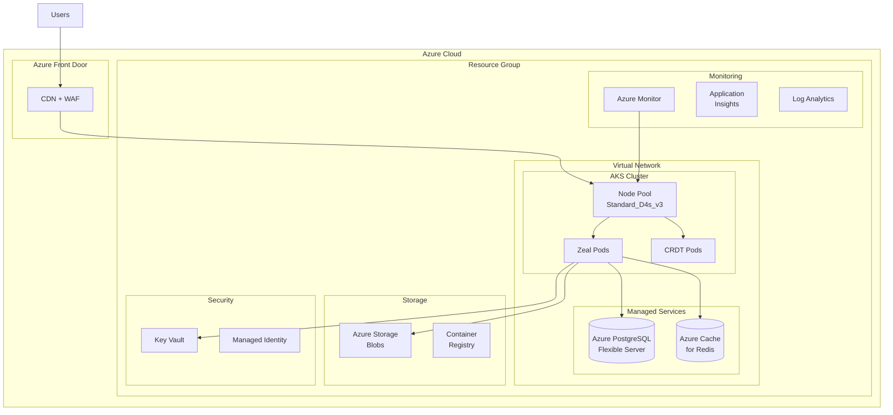

# Zeal Azure AKS Deployment

Enterprise deployment of Zeal on Microsoft Azure using AKS, Azure Database for PostgreSQL, Azure Cache for Redis, and other Azure managed services.

## Table of Contents

- [Overview](#overview)
- [Architecture](#architecture)
- [Prerequisites](#prerequisites)
- [Quick Start](#quick-start)
- [Security](#security)
- [Monitoring](#monitoring)
- [Disaster Recovery](#disaster-recovery)
- [Troubleshooting](#troubleshooting)

## Overview

This deployment leverages Azure managed services for enterprise-grade Zeal installation:

- **AKS** - Azure Kubernetes Service for container orchestration
- **Azure Database for PostgreSQL** - Managed PostgreSQL with geo-redundancy
- **Azure Cache for Redis** - Managed Redis for caching and pub/sub
- **Azure Storage** - Blob storage for uploads and backups
- **Azure Container Registry** - Private Docker registry
- **Azure Front Door** - Global CDN and WAF
- **Azure Monitor** - Comprehensive monitoring and logging
- **Azure Key Vault** - Secure secrets management
- **Azure Backup** - Automated backup solution

## Architecture



## Prerequisites

### Required Tools
- Azure CLI 2.x
- kubectl 1.28+
- Helm 3.x
- Terraform 1.5+

### Azure Setup
```bash
# Install Azure CLI
curl -sL https://aka.ms/InstallAzureCLIDeb | sudo bash

# Login to Azure
az login

# Set subscription
az account set --subscription "Your Subscription Name"

# Install AKS CLI
az aks install-cli
```

## Quick Start

```bash
# Clone repository
git clone https://github.com/offbit-ai/zeal.git
cd zeal/deployments/azure

# Set variables
export RESOURCE_GROUP=zeal-production-rg
export CLUSTER_NAME=zeal-aks
export LOCATION=eastus
export DOMAIN=zeal.example.com

# Run deployment
./deploy.sh
```

## Cost Optimization

### Cost Optimization Tips

- Use Spot instances for non-critical workloads (significant savings)
- Reserved instances for predictable workloads (substantial discounts)
- Auto-scaling to reduce idle capacity
- Use Azure Hybrid Benefit if you have Windows Server licenses
- Implement storage lifecycle policies for automated cost management

## Security

### Network Security
- Private endpoints for all data services
- Network Security Groups (NSGs)
- Azure Firewall for egress control
- DDoS Protection Standard

### Identity & Access
- Managed Identity for pod authentication
- Azure AD integration for RBAC
- Key Vault for secrets management
- Conditional Access policies

### Data Protection
- Encryption at rest (Azure managed keys)
- Encryption in transit (TLS 1.3)
- Azure Backup for disaster recovery
- Geo-redundant storage

### Compliance
- Azure Policy for governance
- Azure Security Center recommendations
- Regulatory compliance dashboard
- Activity logs and audit trails

## Monitoring

### Azure Monitor
```bash
# View cluster metrics
az monitor metrics list \
  --resource /subscriptions/<sub>/resourceGroups/<rg>/providers/Microsoft.ContainerService/managedClusters/<cluster> \
  --metric "node cpu usage percentage"

# Query logs
az monitor log-analytics query \
  --workspace <workspace-id> \
  --analytics-query "ContainerLog | where TimeGenerated > ago(1h)"
```

### Application Insights
```bash
# Get instrumentation key
az monitor app-insights component show \
  --resource-group $RESOURCE_GROUP \
  --app zeal-insights \
  --query instrumentationKey
```

### Alerts
```bash
# Create alert rule
az monitor metrics alert create \
  --name high-cpu \
  --resource-group $RESOURCE_GROUP \
  --scopes <resource-id> \
  --condition "avg cpu usage percentage > 80" \
  --window-size 5m \
  --evaluation-frequency 1m
```

## Disaster Recovery

### Backup Strategy
- PostgreSQL: Automated backups with 30-day retention
- Redis: AOF persistence + scheduled backups
- AKS: Velero for cluster backup
- Storage: Geo-redundant storage (GRS)

### Recovery Procedures
```bash
# Restore PostgreSQL
az postgres flexible-server restore \
  --resource-group $RESOURCE_GROUP \
  --name zeal-postgres-restored \
  --source-server zeal-postgres \
  --restore-time "2024-01-01T00:00:00Z"

# Restore AKS cluster
velero restore create --from-backup <backup-name>
```

### High Availability
- Multi-zone deployment for AKS nodes
- Zone-redundant storage
- Geo-redundant PostgreSQL backups
- Redis cluster mode with replicas

## Troubleshooting

### Common Issues

#### AKS Node Issues
```bash
# Check node status
kubectl get nodes
kubectl describe node <node-name>

# View node logs
kubectl get events --all-namespaces

# SSH to node (if enabled)
kubectl debug node/<node-name> -it --image=mcr.microsoft.com/dotnet/runtime-deps:6.0
```

#### Database Connectivity
```bash
# Test PostgreSQL connection
az postgres flexible-server connect \
  --name zeal-postgres \
  --admin-user zealadmin \
  --interactive

# Check firewall rules
az postgres flexible-server firewall-rule list \
  --resource-group $RESOURCE_GROUP \
  --name zeal-postgres
```

#### Performance Issues
```bash
# Check resource usage
az aks nodepool show \
  --resource-group $RESOURCE_GROUP \
  --cluster-name $CLUSTER_NAME \
  --name nodepool1 \
  --query "count"

# Scale nodes
az aks nodepool scale \
  --resource-group $RESOURCE_GROUP \
  --cluster-name $CLUSTER_NAME \
  --name nodepool1 \
  --node-count 5
```

## Support

- Azure Support: https://azure.microsoft.com/support
- Zeal Documentation: https://github.com/offbit-ai/zeal
- Community: https://discord.gg/zeal