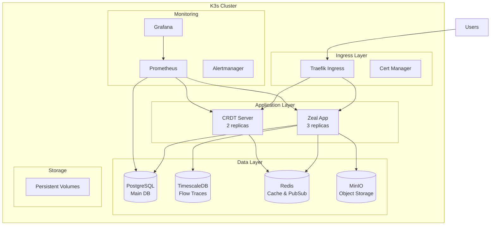

# Zeal K3s Production Deployment

Complete production deployment of Zeal on K3s - lightweight Kubernetes for self-hosted environments.

## Table of Contents

- [Overview](#overview)
- [Architecture](#architecture)
- [Prerequisites](#prerequisites)
- [Quick Start](#quick-start)
- [Detailed Installation](#detailed-installation)
- [Configuration Options](#configuration-options)
- [High Availability Setup](#high-availability-setup)
- [Monitoring & Observability](#monitoring--observability)
- [Backup & Recovery](#backup--recovery)
- [Security Considerations](#security-considerations)
- [Troubleshooting](#troubleshooting)
- [Maintenance](#maintenance)

## Overview

This deployment provides a production-ready Zeal installation on K3s with:

- **Full Stack Deployment**: All Zeal components including PostgreSQL, TimescaleDB, Redis, MinIO, and CRDT server
- **High Availability**: Multi-replica deployments with automatic failover
- **TLS/HTTPS**: Automatic certificate management with Let's Encrypt
- **Monitoring**: Prometheus, Grafana, and Alertmanager integration
- **Backups**: Automated database backups with retention policies
- **Resource Management**: CPU and memory limits with autoscaling
- **Security**: Network policies, RBAC, and secrets management

## Architecture



## Prerequisites

### System Requirements

- **CPU**: Minimum 4 cores, recommended 8 cores
- **RAM**: Minimum 8GB, recommended 16GB
- **Storage**: Minimum 100GB SSD, recommended 500GB SSD
- **OS**: Ubuntu 20.04/22.04, Debian 11/12, or RHEL 8/9

### Software Requirements

- K3s v1.28+ (will be installed if not present)
- kubectl v1.28+
- Helm v3.12+
- jq (for JSON processing)
- openssl (for secret generation)

## Quick Start

1. **Clone the repository**:
```bash
git clone https://github.com/offbit-ai/zeal.git
cd zeal/deployments/k3s
```

2. **Run the deployment script**:
```bash
# For local development
./deploy.sh --domain zeal.local --no-tls

# For production with custom domain
./deploy.sh --domain zeal.example.com
```

3. **Access Zeal**:
```bash
# Get the cluster IP
kubectl get node -o wide

# Add to /etc/hosts (for local testing)
echo "<CLUSTER_IP> zeal.local" | sudo tee -a /etc/hosts

# Open in browser
open https://zeal.local
```

## Detailed Installation

### Step 1: Install K3s

```bash
# Install K3s with default configuration
curl -sfL https://get.k3s.io | sh -

# Install K3s with custom configuration
curl -sfL https://get.k3s.io | sh -s - \
  --write-kubeconfig-mode 644 \
  --disable traefik \
  --disable local-storage

# Verify installation
kubectl get nodes
```

### Step 2: Configure Storage

K3s comes with local-path provisioner by default. For production, consider using:

```bash
# Option 1: Longhorn (recommended for production)
kubectl apply -f https://raw.githubusercontent.com/longhorn/longhorn/v1.5.1/deploy/longhorn.yaml

# Option 2: OpenEBS
kubectl apply -f https://openebs.github.io/charts/openebs-operator.yaml

# Option 3: NFS provisioner
helm install nfs-subdir-external-provisioner \
  nfs-subdir-external-provisioner/nfs-subdir-external-provisioner \
  --set nfs.server=x.x.x.x \
  --set nfs.path=/exported/path
```

### Step 3: Configure DNS

For production deployment, configure your DNS:

```bash
# Get your cluster's external IP
CLUSTER_IP=$(kubectl get nodes -o jsonpath='{.items[0].status.addresses[?(@.type=="ExternalIP")].address}')
echo "Create an A record: zeal.example.com -> $CLUSTER_IP"
```

### Step 4: Deploy Zeal

```bash
# Basic deployment
./deploy.sh --domain zeal.example.com

# Advanced deployment with options
./deploy.sh \
  --namespace production \
  --domain zeal.example.com \
  --storage-class longhorn \
  --postgres-size 50Gi \
  --timescale-size 100Gi
```

## Configuration Options

### Environment Variables

Create a `.env` file for deployment configuration:

```bash
# Deployment Configuration
DEPLOYMENT_NAME=zeal
NAMESPACE=zeal-production
DOMAIN=zeal.example.com

# Storage Configuration
STORAGE_CLASS=longhorn
POSTGRES_STORAGE_SIZE=50Gi
TIMESCALE_STORAGE_SIZE=100Gi
REDIS_STORAGE_SIZE=20Gi
MINIO_STORAGE_SIZE=200Gi

# Features
ENABLE_MONITORING=true
ENABLE_BACKUPS=true
ENABLE_TLS=true

# Resource Limits
ZEAL_CPU_REQUEST=500m
ZEAL_CPU_LIMIT=2000m
ZEAL_MEMORY_REQUEST=512Mi
ZEAL_MEMORY_LIMIT=2Gi

# Replicas
ZEAL_REPLICAS=3
CRDT_REPLICAS=2

# Secrets (leave empty to auto-generate)
DB_PASSWORD=
REDIS_PASSWORD=
NEXTAUTH_SECRET=
MINIO_ROOT_PASSWORD=
```

### Helm Values

For Helm-based deployment, customize `helm/values.yaml`:

```yaml
# helm/values.yaml
global:
  domain: zeal.example.com
  storageClass: longhorn

zeal:
  replicas: 3
  image:
    repository: ghcr.io/offbit-ai/zeal
    tag: latest
  resources:
    requests:
      cpu: 500m
      memory: 512Mi
    limits:
      cpu: 2000m
      memory: 2Gi
  autoscaling:
    enabled: true
    minReplicas: 3
    maxReplicas: 10
    targetCPUUtilizationPercentage: 70

postgresql:
  enabled: true
  persistence:
    size: 50Gi
  resources:
    requests:
      cpu: 500m
      memory: 512Mi

timescaledb:
  enabled: true
  persistence:
    size: 100Gi
  resources:
    requests:
      cpu: 500m
      memory: 1Gi

redis:
  enabled: true
  persistence:
    size: 20Gi
  resources:
    requests:
      cpu: 250m
      memory: 256Mi

minio:
  enabled: true
  persistence:
    size: 200Gi
  resources:
    requests:
      cpu: 500m
      memory: 512Mi

monitoring:
  enabled: true
  prometheus:
    retention: 30d
    storageSize: 50Gi
  grafana:
    adminPassword: changeme
```

## High Availability Setup

### Multi-Master K3s Cluster

```bash
# Install first master
curl -sfL https://get.k3s.io | sh -s - server \
  --cluster-init \
  --tls-san load-balancer.example.com

# Get token
cat /var/lib/rancher/k3s/server/node-token

# Install additional masters
curl -sfL https://get.k3s.io | sh -s - server \
  --server https://first-master:6443 \
  --token <TOKEN> \
  --tls-san load-balancer.example.com

# Install worker nodes
curl -sfL https://get.k3s.io | sh -s - agent \
  --server https://load-balancer.example.com:6443 \
  --token <TOKEN>
```

### Database High Availability

Deploy PostgreSQL with replication:

```bash
# Deploy PostgreSQL with HA
helm install postgresql bitnami/postgresql-ha \
  --namespace zeal-production \
  --set postgresql.password=<PASSWORD> \
  --set postgresql.database=zeal_db \
  --set postgresql.username=zeal_user \
  --set persistence.size=50Gi
```

### CRDT Server Clustering

The CRDT server automatically forms a cluster using Redis:

```yaml
apiVersion: apps/v1
kind: StatefulSet
metadata:
  name: crdt-server
spec:
  replicas: 3
  serviceName: crdt-server-headless
  template:
    spec:
      containers:
      - name: crdt-server
        env:
        - name: CLUSTER_MODE
          value: "true"
        - name: POD_NAME
          valueFrom:
            fieldRef:
              fieldPath: metadata.name
```

## Monitoring & Observability

### Prometheus Metrics

Zeal exposes metrics at `/metrics`:

```yaml
# ServiceMonitor for Prometheus
apiVersion: monitoring.coreos.com/v1
kind: ServiceMonitor
metadata:
  name: zeal-metrics
spec:
  selector:
    matchLabels:
      app: zeal
  endpoints:
  - port: metrics
    interval: 30s
    path: /metrics
```

### Grafana Dashboards

Import pre-built dashboards:

```bash
# Deploy dashboards
kubectl apply -f monitoring/dashboards/

# Access Grafana
kubectl port-forward -n monitoring svc/prometheus-grafana 3000:80
```

Available dashboards:
- **Zeal Overview**: Application metrics, request rates, error rates
- **Workflow Execution**: Execution counts, duration, success rates
- **CRDT Sync**: Sync operations, conflicts, latency
- **Database Performance**: Query performance, connection pools
- **Resource Usage**: CPU, memory, disk, network

### Logging with Loki

Deploy Loki for log aggregation:

```bash
helm install loki grafana/loki-stack \
  --namespace monitoring \
  --set grafana.enabled=false \
  --set promtail.enabled=true \
  --set loki.persistence.enabled=true \
  --set loki.persistence.size=50Gi
```

### Distributed Tracing

Deploy Jaeger for tracing:

```bash
kubectl create namespace observability
kubectl apply -f https://github.com/jaegertracing/jaeger-operator/releases/download/v1.47.0/jaeger-operator.yaml -n observability

# Deploy Jaeger instance
cat <<EOF | kubectl apply -f -
apiVersion: jaegertracing.io/v1
kind: Jaeger
metadata:
  name: zeal-tracing
  namespace: observability
spec:
  strategy: production
  storage:
    type: elasticsearch
EOF
```

## Backup & Recovery

### Automated Backups

The deployment includes automated daily backups:

```yaml
# backup/backup-schedule.yaml
apiVersion: batch/v1
kind: CronJob
metadata:
  name: backup-all
spec:
  schedule: "0 2 * * *"  # 2 AM daily
  jobTemplate:
    spec:
      template:
        spec:
          containers:
          - name: backup
            image: zeal-backup:latest
            command: ["/scripts/backup.sh"]
```

### Manual Backup

```bash
# Backup PostgreSQL
kubectl exec -n zeal-production postgres-0 -- \
  pg_dump -U zeal_user zeal_db > backup-$(date +%Y%m%d).sql

# Backup TimescaleDB
kubectl exec -n zeal-production timescaledb-0 -- \
  pg_dump -U zeal_user zeal_traces > traces-backup-$(date +%Y%m%d).sql

# Backup persistent volumes
velero backup create zeal-backup --include-namespaces zeal-production
```

### Disaster Recovery

```bash
# Restore from backup
velero restore create --from-backup zeal-backup

# Restore PostgreSQL
kubectl exec -i -n zeal-production postgres-0 -- \
  psql -U zeal_user zeal_db < backup.sql

# Restore TimescaleDB
kubectl exec -i -n zeal-production timescaledb-0 -- \
  psql -U zeal_user zeal_traces < traces-backup.sql
```

## Security Considerations

### Network Policies

```yaml
# network-policies.yaml
apiVersion: networking.k8s.io/v1
kind: NetworkPolicy
metadata:
  name: zeal-network-policy
spec:
  podSelector:
    matchLabels:
      app: zeal
  policyTypes:
  - Ingress
  - Egress
  ingress:
  - from:
    - namespaceSelector:
        matchLabels:
          name: ingress-nginx
    ports:
    - protocol: TCP
      port: 3000
  egress:
  - to:
    - podSelector:
        matchLabels:
          app: postgres
    - podSelector:
        matchLabels:
          app: redis
```

### RBAC Configuration

```yaml
# rbac.yaml
apiVersion: rbac.authorization.k8s.io/v1
kind: Role
metadata:
  name: zeal-role
rules:
- apiGroups: [""]
  resources: ["configmaps", "secrets"]
  verbs: ["get", "list", "watch"]
---
apiVersion: rbac.authorization.k8s.io/v1
kind: RoleBinding
metadata:
  name: zeal-rolebinding
roleRef:
  apiGroup: rbac.authorization.k8s.io
  kind: Role
  name: zeal-role
subjects:
- kind: ServiceAccount
  name: zeal-sa
```

### Secrets Management

Use Sealed Secrets for GitOps:

```bash
# Install Sealed Secrets controller
kubectl apply -f https://github.com/bitnami-labs/sealed-secrets/releases/download/v0.18.0/controller.yaml

# Create sealed secret
echo -n mypassword | kubectl create secret generic mysecret \
  --dry-run=client --from-file=password=/dev/stdin -o yaml | \
  kubeseal -o yaml > sealed-secret.yaml
```

### Pod Security Policies

```yaml
apiVersion: policy/v1beta1
kind: PodSecurityPolicy
metadata:
  name: zeal-psp
spec:
  privileged: false
  allowPrivilegeEscalation: false
  requiredDropCapabilities:
    - ALL
  volumes:
    - 'configMap'
    - 'emptyDir'
    - 'projected'
    - 'secret'
    - 'persistentVolumeClaim'
  runAsUser:
    rule: 'MustRunAsNonRoot'
  seLinux:
    rule: 'RunAsAny'
  fsGroup:
    rule: 'RunAsAny'
```

## Troubleshooting

### Common Issues

#### Pods not starting

```bash
# Check pod status
kubectl get pods -n zeal-production

# View pod logs
kubectl logs -f deployment/zeal -n zeal-production

# Describe pod for events
kubectl describe pod <POD_NAME> -n zeal-production
```

#### Database connection issues

```bash
# Test PostgreSQL connection
kubectl exec -it postgres-0 -n zeal-production -- psql -U zeal_user -d zeal_db -c "SELECT 1"

# Check service endpoints
kubectl get endpoints -n zeal-production
```

#### Storage issues

```bash
# Check PVC status
kubectl get pvc -n zeal-production

# Check storage class
kubectl get storageclass

# Check PV status
kubectl get pv
```

#### Ingress not working

```bash
# Check ingress status
kubectl describe ingress zeal-ingress -n zeal-production

# Check traefik logs
kubectl logs -f deployment/traefik -n kube-system

# Test with port-forward
kubectl port-forward svc/zeal 3000:3000 -n zeal-production
```

### Debug Mode

Enable debug logging:

```yaml
# Set in deployment
env:
- name: DEBUG
  value: "true"
- name: LOG_LEVEL
  value: "debug"
```

### Health Checks

```bash
# Check application health
curl -k https://zeal.local/api/health

# Check database health
kubectl exec postgres-0 -n zeal-production -- pg_isready

# Check Redis health
kubectl exec redis-0 -n zeal-production -- redis-cli ping
```

## Maintenance

### Updates and Upgrades

```bash
# Update Zeal application
kubectl set image deployment/zeal zeal=ghcr.io/offbit-ai/zeal:v2.0.0 -n zeal-production

# Rolling restart
kubectl rollout restart deployment/zeal -n zeal-production

# Check rollout status
kubectl rollout status deployment/zeal -n zeal-production
```

### Scaling

```bash
# Scale horizontally
kubectl scale deployment/zeal --replicas=5 -n zeal-production

# Enable autoscaling
kubectl autoscale deployment/zeal \
  --min=3 --max=10 \
  --cpu-percent=70 \
  -n zeal-production
```

### Database Maintenance

```bash
# Vacuum PostgreSQL
kubectl exec postgres-0 -n zeal-production -- \
  psql -U zeal_user -d zeal_db -c "VACUUM ANALYZE;"

# Reindex
kubectl exec postgres-0 -n zeal-production -- \
  psql -U zeal_user -d zeal_db -c "REINDEX DATABASE zeal_db;"
```

### Log Rotation

Configure log rotation in the deployment:

```yaml
spec:
  containers:
  - name: zeal
    env:
    - name: LOG_MAX_SIZE
      value: "100M"
    - name: LOG_MAX_FILES
      value: "10"
```

## Performance Tuning

### PostgreSQL Optimization

```sql
-- Update postgresql.conf
ALTER SYSTEM SET shared_buffers = '2GB';
ALTER SYSTEM SET effective_cache_size = '6GB';
ALTER SYSTEM SET maintenance_work_mem = '512MB';
ALTER SYSTEM SET checkpoint_completion_target = 0.9;
ALTER SYSTEM SET wal_buffers = '16MB';
ALTER SYSTEM SET default_statistics_target = 100;
ALTER SYSTEM SET random_page_cost = 1.1;
```

### Redis Optimization

```yaml
# Redis configuration
redis-server --maxmemory 2gb --maxmemory-policy allkeys-lru
```

### K3s Optimization

```bash
# Optimize K3s server
curl -sfL https://get.k3s.io | sh -s - server \
  --kube-apiserver-arg="max-requests-inflight=200" \
  --kube-apiserver-arg="max-mutating-requests-inflight=50" \
  --kube-controller-manager-arg="node-monitor-period=2s" \
  --kube-controller-manager-arg="node-monitor-grace-period=16s" \
  --kubelet-arg="max-pods=110"
```

## Support

For issues and questions:
- GitHub Issues: https://github.com/offbit-ai/zeal/issues
- Documentation: https://docs.zeal.com
- Community Discord: https://discord.gg/zeal