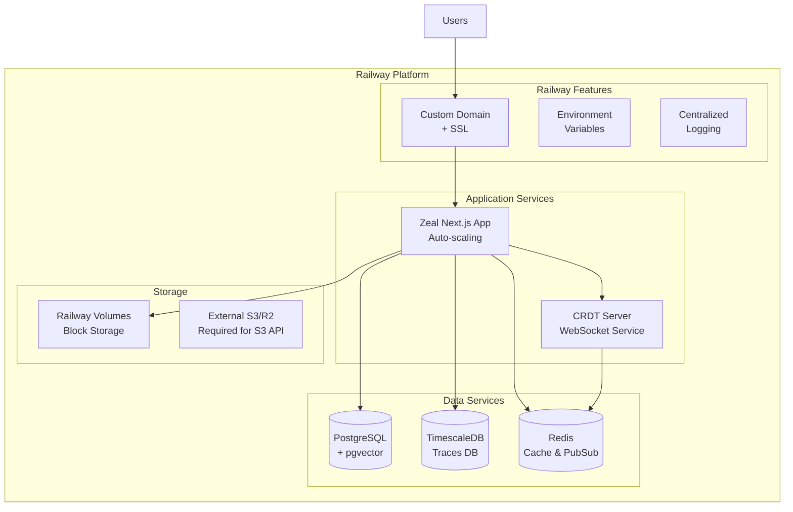

# 🚂 Railway Deployment Guide for Zeal

Deploy Zeal to Railway - a modern platform-as-a-service that simplifies deployment with automatic builds, deployments, and infrastructure management.

## 📋 Table of Contents

- [Overview](#overview)
- [Prerequisites](#prerequisites)
- [Quick Start](#quick-start)
- [Architecture](#architecture)
- [Manual Setup](#manual-setup)
- [Configuration](#configuration)
- [Monitoring](#monitoring)
- [Troubleshooting](#troubleshooting)
- [Cost Optimization](#cost-optimization)

## 🎯 Overview

Railway provides a streamlined deployment experience for Zeal with:

- **Automatic deployments** from GitHub
- **Built-in PostgreSQL and Redis** with automated backups
- **SSL certificates** automatically provisioned
- **Environment management** with secrets handling
- **Preview environments** for pull requests
- **Zero-downtime deployments**
- **Integrated monitoring** and logs

### Why Railway?

- **Simple pricing**: Pay only for what you use
- **Developer-friendly**: Git-based deployments
- **Fast deployments**: Builds cached automatically
- **Global edge network**: Low latency worldwide
- **No DevOps required**: Infrastructure managed for you

## 📋 Prerequisites

- GitHub account (for automatic deployments)
- Railway account (free tier available)
- Railway CLI (optional, for local deployment)

## 🚀 Quick Start

### Option 1: Deploy via Script (Recommended)

```bash
# Clone the repository
git clone https://github.com/offbit-ai/zeal.git
cd zeal

# Run deployment script
cd deployments/railway
chmod +x deploy.sh
./deploy.sh production

# Follow the interactive prompts
```

### Option 2: Manual Deploy via Railway Dashboard

1. Fork/clone this repository
2. Sign up at [Railway](https://railway.app)
3. Create new project from GitHub repo
4. Railway will auto-detect and deploy

## 🏗️ Architecture

### Core Services Deployment



### Service Configuration

| Service | Railway Component | Notes |
|---------|------------------|-------|
| **Main App** | Railway Service | Auto-scales based on traffic |
| **PostgreSQL** | Railway PostgreSQL | Includes pgvector extension |
| **TimescaleDB** | Railway PostgreSQL | Separate instance for traces |
| **Redis** | Railway Redis | For cache and CRDT sync |
| **CRDT Server** | Railway Service | WebSocket connections |
| **Storage** | Railway Volumes or External S3 | Block storage or S3-compatible |
| **CDN** | Railway Edge | Global distribution |

## 🔧 Manual Setup

### Step 1: Install Railway CLI

```bash
# macOS
brew install railway

# Linux/WSL
curl -fsSL https://railway.app/install.sh | sh

# Windows
# Download from https://github.com/railwayapp/cli/releases
```

### Step 2: Login to Railway

```bash
railway login
```

### Step 3: Initialize Project

```bash
# In your Zeal directory
railway init --name zeal-production

# Link to GitHub (recommended)
railway link
```

### Step 4: Add Required Services

```bash
# PostgreSQL with pgvector
railway add --plugin postgresql
railway vars set POSTGRES_EXTENSIONS=pgvector

# Redis
railway add --plugin redis

# Create second PostgreSQL for TimescaleDB
railway add --plugin postgresql --name timescaledb
railway vars set POSTGRES_EXTENSIONS=timescaledb --service timescaledb
```

### Step 5: Configure Environment Variables

```bash
# Copy example and edit
cp deployments/railway/.env.example .env.railway
# Edit .env.railway with your values

# Set variables in Railway
railway vars set --envfile .env.railway
```

### Step 6: Deploy

```bash
# Deploy to Railway
railway up

# Open in browser
railway open
```

## ⚙️ Configuration

### Required Environment Variables

Railway automatically provides:
- `DATABASE_URL` - PostgreSQL connection string
- `REDIS_URL` - Redis connection string
- `PORT` - Port to bind to
- `RAILWAY_PUBLIC_DOMAIN` - Your app's public URL

You need to set:

```bash
# Authentication
NEXTAUTH_URL=https://$RAILWAY_PUBLIC_DOMAIN
NEXTAUTH_SECRET=<generate-with-openssl-rand-base64-32>

# CRDT Server
NEXT_PUBLIC_CRDT_SERVER_URL=wss://$RAILWAY_PUBLIC_DOMAIN/crdt
CRDT_SERVER_PORT=8080

# TimescaleDB (second PostgreSQL instance)
TIMESCALE_HOST=<from-railway-dashboard>
TIMESCALE_PORT=5432
TIMESCALE_DATABASE=zeal_traces
TIMESCALE_USER=postgres
TIMESCALE_PASSWORD=<from-railway-dashboard>

# Storage (choose one)
STORAGE_TYPE=local  # or 's3', 'r2', 'gcs'
STORAGE_PATH=/app/storage

# Optional: External S3
# AWS_ACCESS_KEY_ID=
# AWS_SECRET_ACCESS_KEY=
# AWS_S3_BUCKET=
```

### Service-Specific Configurations

#### PostgreSQL with pgvector

Railway PostgreSQL needs pgvector extension:

```sql
-- Railway will run this automatically if you set POSTGRES_EXTENSIONS=pgvector
CREATE EXTENSION IF NOT EXISTS vector;
CREATE EXTENSION IF NOT EXISTS pg_trgm;
CREATE EXTENSION IF NOT EXISTS uuid-ossp;
```

#### TimescaleDB Setup

For the second PostgreSQL instance:

```sql
-- Set via POSTGRES_EXTENSIONS=timescaledb
CREATE EXTENSION IF NOT EXISTS timescaledb;

-- Create hypertables (handled by init script)
SELECT create_hypertable('flow_traces', 'created_at');
SELECT create_hypertable('flow_trace_events', 'timestamp');
```

#### CRDT Server Configuration

The CRDT server runs as a separate Railway service:

```toml
# In railway.toml
[[services]]
name = "crdt-server"
source = "./crdt-server"
builder = "DOCKERFILE"
dockerfilePath = "./crdt-server/Dockerfile"
```

### Storage Options

Railway volumes are **block storage** (filesystem), not S3-compatible object storage.

#### Option 1: Railway Volumes (Local Filesystem)
For small-scale deployments:

1. Go to your service settings in Railway dashboard
2. Add a volume mount at `/app/storage`
3. Set size based on needs (10GB recommended)
4. Configure environment:
   ```bash
   STORAGE_TYPE=local
   STORAGE_PATH=/app/storage
   ```

#### Option 2: External S3-Compatible Storage (Recommended for Production)
For S3 API compatibility and scalability:

**AWS S3:**
```bash
STORAGE_TYPE=s3
AWS_ACCESS_KEY_ID=your-key
AWS_SECRET_ACCESS_KEY=your-secret
AWS_S3_BUCKET=zeal-uploads
AWS_REGION=us-east-1
```

**Cloudflare R2 (Recommended - No egress fees):**
```bash
STORAGE_TYPE=r2
R2_ACCOUNT_ID=your-account-id
R2_ACCESS_KEY_ID=your-key
R2_SECRET_ACCESS_KEY=your-secret
R2_BUCKET_NAME=zeal-uploads
R2_PUBLIC_URL=https://your-bucket.r2.dev
```

**MinIO (Self-hosted):**
```bash
STORAGE_TYPE=minio
MINIO_ENDPOINT=your-minio-server.com
MINIO_ACCESS_KEY=your-key
MINIO_SECRET_KEY=your-secret
MINIO_BUCKET=zeal-uploads
MINIO_USE_SSL=true
```

## 📊 Monitoring

### Railway Dashboard

Railway provides built-in monitoring:

- **Metrics**: CPU, Memory, Network usage
- **Logs**: Centralized log viewer
- **Deployments**: History and rollback
- **Alerts**: Set up via webhooks

### External Monitoring (Optional)

```bash
# Datadog
railway vars set DD_API_KEY=your-key
railway vars set DD_SITE=datadoghq.com

# New Relic
railway vars set NEW_RELIC_LICENSE_KEY=your-key
railway vars set NEW_RELIC_APP_NAME=zeal

# Sentry
railway vars set SENTRY_DSN=your-dsn
```

## 🚨 Troubleshooting

### Common Issues

#### 1. Build Failures

```bash
# Check build logs
railway logs --build

# Clear build cache
railway up --no-cache
```

#### 2. Database Connection Issues

```bash
# Verify DATABASE_URL
railway vars

# Test connection
railway run psql $DATABASE_URL
```

#### 3. CRDT Server WebSocket Issues

```bash
# Check CRDT logs
railway logs --service crdt-server

# Verify WebSocket endpoint
curl -i -N -H "Connection: Upgrade" \
     -H "Upgrade: websocket" \
     -H "Sec-WebSocket-Version: 13" \
     -H "Sec-WebSocket-Key: test" \
     https://your-app.railway.app/crdt
```

#### 4. Storage Issues

```bash
# Check volume mounts
railway volume

# Verify permissions
railway run ls -la /app/storage
```

### Debug Mode

Enable debug logging:

```bash
railway vars set DEBUG=true
railway vars set LOG_LEVEL=debug
railway vars set VERBOSE_LOGGING=true
```

## 💰 Cost Optimization

### Railway Pricing

- **Starter**: $5/month (includes $5 usage)
- **Pro**: Pay-as-you-go with more resources
- **Enterprise**: Custom pricing

### Optimization Tips

1. **Use Hobby Plan for Development**
   - Free $5 monthly credit
   - Perfect for testing

2. **Optimize Database Queries**
   - Add proper indexes
   - Use connection pooling
   - Enable query caching

3. **Configure Autoscaling**
   ```bash
   # In railway.toml
   [scaling]
   minReplicas = 1
   maxReplicas = 5
   targetCPUPercent = 70
   ```

4. **Use External S3-Compatible Storage**
   - Railway volumes are block storage (not S3-compatible)
   - For production, use AWS S3, Cloudflare R2, or MinIO
   - Cloudflare R2 recommended (no egress fees)
   - Railway volumes good for <10GB deployments

5. **Monitor Usage**
   ```bash
   # Check current usage
   railway usage
   
   # Set spending limits in dashboard
   ```

## 🔒 Security

### Best Practices

1. **Environment Variables**
   - Never commit secrets
   - Use Railway's secret management
   - Rotate keys regularly

2. **Network Security**
   - Railway provides DDoS protection
   - Use private networking for services
   - Enable rate limiting

3. **Database Security**
   - Use connection pooling
   - Enable SSL for connections
   - Regular backups (automatic)

4. **Authentication**
   ```bash
   # Enable auth
   railway vars set ZEAL_AUTH_ENABLED=true
   railway vars set ZEAL_AUTH_MODE=production
   ```

## 🔄 CI/CD Integration

### GitHub Actions

```yaml
# .github/workflows/railway-deploy.yml
name: Deploy to Railway

on:
  push:
    branches: [main]

jobs:
  deploy:
    runs-on: ubuntu-latest
    steps:
      - uses: actions/checkout@v3
      
      - name: Install Railway
        run: npm install -g @railway/cli
      
      - name: Deploy
        env:
          RAILWAY_TOKEN: ${{ secrets.RAILWAY_TOKEN }}
        run: railway up --environment production
```

### Automatic Deployments

Railway automatically deploys when:
- Pushing to connected branch
- Merging pull requests
- Manual trigger in dashboard

## 📚 Advanced Configuration

### Multi-Environment Setup

```bash
# Create environments
railway environment create staging
railway environment create production

# Deploy to specific environment
railway up --environment staging
```

### Custom Domains

```bash
# Add custom domain
railway domain add zeal.example.com

# Configure DNS (add CNAME)
# zeal.example.com -> your-app.railway.app
```

### Horizontal Scaling

For high traffic:

1. **Enable replicas** in dashboard
2. **Configure load balancing**
3. **Set up Redis Cluster** for CRDT
4. **Use read replicas** for PostgreSQL

## 🤝 Support

### Railway Resources

- [Railway Documentation](https://docs.railway.app)
- [Railway Discord](https://discord.gg/railway)
- [Railway Status](https://status.railway.app)

### Zeal Resources

- [Zeal Documentation](https://docs.zeal.com)
- [GitHub Issues](https://github.com/offbit-ai/zeal/issues)
- [Community Discord](https://discord.gg/zeal)

## 📄 License

Apache 2.0 - See [LICENSE](../../LICENSE) for details