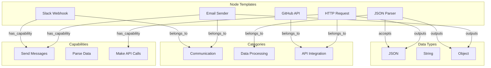

# Knowledge Graph / GraphRAG Specification for Zeal Orchestrator

## Problem Statement

The current orchestrator agent has limited awareness of available node templates and their capabilities. This leads to:

- Inefficient searches with multiple retries
- Poor understanding of node relationships and compatibility
- Inability to suggest optimal node combinations
- Limited reasoning about workflow composition

## Proposed Solution: Knowledge Graph with GraphRAG

### 1. Knowledge Graph Structure



### 2. Graph Schema

#### Node Types

1. **Template Node**
   - id: string
   - title: string
   - description: string
   - category: string
   - subcategory: string
   - tags: string[]
   - version: string

2. **Port Node**
   - id: string
   - templateId: string
   - type: 'input' | 'output'
   - dataType: string
   - label: string

3. **Capability Node**
   - id: string
   - name: string
   - description: string

4. **DataType Node**
   - id: string
   - name: string
   - schema: JSONSchema

5. **Service Node**
   - id: string
   - name: string (e.g., 'slack', 'github', 'stripe')
   - type: string (e.g., 'communication', 'vcs', 'payment')

#### Edge Types

1. **has_port**: Template → Port
2. **accepts**: Port → DataType
3. **outputs**: Port → DataType
4. **compatible_with**: Port → Port
5. **has_capability**: Template → Capability
6. **belongs_to_category**: Template → Category
7. **integrates_with**: Template → Service
8. **commonly_used_with**: Template → Template (learned from usage)
9. **alternative_to**: Template → Template

### 3. Implementation Plan

#### Phase 1: Graph Construction

- Build graph from existing template definitions
- Extract relationships from port definitions
- Infer capabilities from descriptions using LLM
- Create service mappings

#### Phase 2: Graph Storage

- Use Neo4j or similar graph database
- Alternative: In-memory graph with persistence
- Indexed for fast traversal

#### Phase 3: GraphRAG Integration

- Implement graph-aware retrieval
- Use graph embeddings for similarity
- Combine with existing vector search

#### Phase 4: Intelligent Agent Queries

- Graph traversal for workflow planning
- Compatibility checking via graph paths
- Capability-based node discovery

### 4. Enhanced Agent Capabilities

With the knowledge graph, the agent can:

1. **Understand Relationships**

   ```cypher
   // Find all nodes that can process GitHub webhook data
   MATCH (gh:Template {title: 'GitHub Webhook'})-[:has_port]->(:Port {type: 'output'})-[:outputs]->(dt:DataType)
   MATCH (processor:Template)-[:has_port]->(:Port {type: 'input'})-[:accepts]->(dt)
   RETURN processor
   ```

2. **Suggest Complete Workflows**

   ```cypher
   // Find path from GitHub events to Slack notifications
   MATCH path = (start:Template)-[:has_port*..10]-(end:Template)
   WHERE start.title =~ '.*GitHub.*' AND end.title =~ '.*Slack.*'
   RETURN path
   ```

3. **Find Alternatives**

   ```cypher
   // If Discord not available, find alternatives
   MATCH (discord:Template {title: 'Discord Webhook'})-[:alternative_to]-(alt:Template)
   RETURN alt
   ```

4. **Check Compatibility**
   ```cypher
   // Verify if two nodes can connect
   MATCH (n1:Template {id: $node1})-[:has_port]->(p1:Port {type: 'output'})-[:outputs]->(dt:DataType)
   MATCH (n2:Template {id: $node2})-[:has_port]->(p2:Port {type: 'input'})-[:accepts]->(dt)
   RETURN COUNT(*) > 0 as compatible
   ```

### 5. Benefits

1. **Faster Search**: Direct graph queries instead of vector similarity
2. **Better Accuracy**: Explicit relationships vs. learned embeddings
3. **Workflow Intelligence**: Understand complete paths and alternatives
4. **Learning**: Can add edges based on usage patterns
5. **Explainability**: Clear reasoning paths for node selection

### 6. Integration with Current System

1. Keep vector search for natural language queries
2. Use graph for:
   - Relationship queries
   - Compatibility checks
   - Workflow path finding
   - Alternative suggestions
3. Combine scores from both systems for ranking

### 7. Future Enhancements

1. **Usage Analytics**: Track successful workflows to improve suggestions
2. **Community Patterns**: Learn from common node combinations
3. **Performance Optimization**: Identify bottleneck nodes
4. **Auto-categorization**: Automatically categorize new templates
5. **Workflow Templates**: Discover and suggest common patterns

## Implementation Priority

1. **High Priority**
   - Build basic graph from templates
   - Implement compatibility checking
   - Add to agent's decision process

2. **Medium Priority**
   - Graph-based search
   - Alternative suggestions
   - Workflow path finding

3. **Low Priority**
   - Learning from usage
   - Community patterns
   - Advanced analytics
