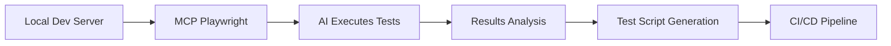

# Workflow Orchestrator UI Specification

## Executive Summary

This document outlines the design and technical specification for a web-based workflow orchestrator UI. The interface enables users to visually create, manage, and monitor automated workflows through a modern, node-based editor similar to n8n or Zapier.

## Design System

### Core Design Principles
- **Visual Clarity**: Clean, minimal interface with clear visual hierarchy
- **Intuitive Flow**: Left-to-right workflow progression
- **Modern Aesthetic**: Rounded corners, subtle shadows, and contemporary iconography
- **Responsive Design**: Optimized for desktop with responsive considerations

### Color Palette

#### Primary Colors
- **Background**: `#F5F5F7` (Light gray)
- **Canvas**: `#FFFFFF` (Pure white)
- **Primary Action**: `#1A1A1A` (Black)
- **Secondary Action**: `#6B7280` (Dark gray)
- **Hover State**: `#374151` (Medium gray)
- **Active State**: `#111827` (Near black)

#### Neutral Colors
- **Text Primary**: `#1A1A1A`
- **Text Secondary**: `#6B7280`
- **Text Tertiary**: `#9CA3AF`
- **Border Default**: `#E5E7EB`
- **Border Hover**: `#D1D5DB`
- **Border Active**: `#9CA3AF`

#### Functional Colors (Monochrome variants)
- **Success**: `#1F2937` (Dark gray)
- **Warning**: `#6B7280` (Medium gray)
- **Error**: `#111827` (Near black)

#### Node Type Colors
- **Trigger Nodes**: `#1A1A1A` (Black)
- **Action Nodes**: `#374151` (Dark gray)
- **Integration Nodes**: `#6B7280` (Medium gray)
- **AI Nodes**: `#1F2937` (Charcoal)

### Typography

```css
/* Font Stack */
font-family: -apple-system, BlinkMacSystemFont, 'Inter', 'Segoe UI', Roboto, sans-serif;

/* Type Scale */
--text-xs: 0.75rem;    /* 12px - Node labels */
--text-sm: 0.875rem;   /* 14px - UI elements */
--text-base: 1rem;     /* 16px - Body text */
--text-lg: 1.125rem;   /* 18px - Headings */
--text-xl: 1.25rem;    /* 20px - Page titles */

/* Font Weights */
--font-regular: 400;
--font-medium: 500;
--font-semibold: 600;
--font-bold: 700;
```

### Spacing System

```css
/* Base unit: 4px */
--space-1: 0.25rem;   /* 4px */
--space-2: 0.5rem;    /* 8px */
--space-3: 0.75rem;   /* 12px */
--space-4: 1rem;      /* 16px */
--space-5: 1.25rem;   /* 20px */
--space-6: 1.5rem;    /* 24px */
--space-8: 2rem;      /* 32px */
--space-10: 2.5rem;   /* 40px */
--space-12: 3rem;     /* 48px */
--space-16: 4rem;     /* 64px */
```

### Component Design Tokens

#### Cards/Nodes
```css
/* Node Dimensions */
--node-width: 280px;
--node-height: 80px;
--node-icon-size: 48px;
--node-border-radius: 12px;
--node-padding: 16px;

/* Node Shadows */
--shadow-sm: 0 1px 2px 0 rgba(0, 0, 0, 0.05);
--shadow-default: 0 4px 6px -1px rgba(0, 0, 0, 0.1);
--shadow-hover: 0 10px 15px -3px rgba(0, 0, 0, 0.1);
--shadow-active: 0 20px 25px -5px rgba(0, 0, 0, 0.1);
```

#### Connections
```css
/* Connection Lines */
--connection-width: 2px;
--connection-color: #D1D5DB;
--connection-color-active: #1A1A1A;
--connection-curve-strength: 0.5;
```

#### Buttons
```css
/* Button Styles */
--button-height-sm: 32px;
--button-height-default: 40px;
--button-height-lg: 48px;
--button-padding-x: 16px;
--button-border-radius: 8px;
```

## UI Framework Recommendation

### Selected Framework: React with Next.js 14

#### Rationale
1. **Performance**: Server-side rendering and optimal bundle splitting
2. **Developer Experience**: Excellent TypeScript support and modern React features
3. **Ecosystem**: Large community and extensive library support
4. **Production Ready**: Battle-tested in enterprise applications

### Core Technology Stack

```json
{
  "framework": "Next.js 14",
  "ui-library": "React 18",
  "styling": "Tailwind CSS 3.4",
  "state-management": "Zustand",
  "canvas-library": "React Flow",
  "icons": "Lucide React",
  "animations": "Framer Motion",
  "forms": "React Hook Form + Zod",
  "data-fetching": "TanStack Query",
  "testing": "Vitest + React Testing Library",
  "e2e-testing": "Playwright",
  "visual-regression": "Playwright + Percy"
}
```

### Component Library Architecture

#### Base Components
- Button
- Input
- Select
- Modal
- Tooltip
- Dropdown
- Card
- Badge
- Icon

#### Workflow Components
- WorkflowCanvas
- NodeCard
- ConnectionLine
- NodePalette
- PropertyPanel
- Toolbar
- MiniMap

## Application Architecture

### Project Structure
```
workflow-orchestrator-ui/
├── src/
│   ├── app/                 # Next.js app directory
│   ├── components/
│   │   ├── ui/             # Base UI components
│   │   ├── workflow/       # Workflow-specific components
│   │   └── layout/         # Layout components
│   ├── hooks/              # Custom React hooks
│   ├── lib/
│   │   ├── api/           # API client functions
│   │   ├── utils/         # Utility functions
│   │   └── constants/     # App constants
│   ├── stores/            # Zustand stores
│   ├── types/             # TypeScript definitions
│   └── styles/            # Global styles
├── public/                # Static assets
└── tests/                 # Test files
```

### Key Features

#### 1. Visual Workflow Editor
- Drag-and-drop node placement
- Connection drawing with bezier curves
- Pan and zoom controls
- Grid snapping
- Auto-layout options

#### 2. Node Library
- Categorized node palette
- Search functionality
- Favorite nodes
- Custom node creation

#### 3. Property Panel
- Dynamic form generation
- Real-time validation
- Conditional fields
- Help tooltips

#### 4. Execution Controls
- Run/pause/stop buttons
- Execution history
- Debug mode
- Step-through execution

#### 5. Collaboration Features
- Real-time updates
- Version control
- Comments
- Share functionality

### Data Models

#### Workflow Schema
```typescript
interface Workflow {
  id: string;
  name: string;
  description?: string;
  nodes: Node[];
  connections: Connection[];
  variables: Variable[];
  settings: WorkflowSettings;
  createdAt: Date;
  updatedAt: Date;
  version: number;
}

interface Node {
  id: string;
  type: string;
  position: { x: number; y: number };
  data: {
    label: string;
    icon: string;
    config: Record<string, any>;
  };
}

interface Connection {
  id: string;
  source: string;
  target: string;
  sourceHandle?: string;
  targetHandle?: string;
}
```

## Performance Considerations

### Optimization Strategies
1. **Virtual Rendering**: Only render visible nodes in viewport
2. **Debounced Updates**: Batch state updates during drag operations
3. **Lazy Loading**: Load node configurations on demand
4. **Web Workers**: Offload heavy computations
5. **Memoization**: Cache expensive calculations

### Performance Targets
- Initial load: < 2 seconds
- Node interaction: < 16ms (60 FPS)
- Workflow save: < 500ms
- Large workflow (100+ nodes): Smooth pan/zoom

## Accessibility

### WCAG 2.1 AA Compliance
- Keyboard navigation for all interactive elements
- Screen reader support with ARIA labels
- Color contrast ratios meeting standards
- Focus indicators
- Alternative text for icons

## Browser Support
- Chrome 90+
- Firefox 88+
- Safari 14+
- Edge 90+

## Testing Strategy

### E2E Testing with Playwright

#### Why Playwright
1. **Cross-browser Testing**: Native support for Chromium, Firefox, and WebKit
2. **Auto-wait Mechanisms**: Intelligent waiting for elements, reducing flaky tests
3. **Powerful Selectors**: Support for CSS, XPath, text, and custom selectors
4. **Network Interception**: Mock API responses for isolated testing
5. **Visual Testing**: Built-in screenshot and video recording capabilities
6. **Parallel Execution**: Fast test runs with built-in parallelization
7. **TypeScript First**: Excellent TypeScript support with auto-completion

#### Alternative Considered: Cypress
While Cypress is excellent for React applications, Playwright was chosen because:
- Better cross-browser support (Cypress has limited Firefox/Safari support)
- Superior handling of iframes and multiple tabs (important for workflow testing)
- Better performance for large test suites
- Native support for component testing alongside E2E

### Test Architecture

```
tests/
├── e2e/
│   ├── fixtures/           # Test data and page objects
│   │   ├── workflows/      # Sample workflow definitions
│   │   └── pages/          # Page object models
│   ├── specs/
│   │   ├── canvas/         # Canvas interaction tests
│   │   ├── nodes/          # Node manipulation tests
│   │   ├── connections/    # Connection drawing tests
│   │   ├── execution/      # Workflow execution tests
│   │   └── accessibility/  # A11y compliance tests
│   └── utils/              # Test helpers
├── visual/                 # Visual regression tests
├── performance/            # Performance benchmarks
└── playwright.config.ts    # Playwright configuration
```

### Core Test Scenarios

#### 1. Canvas Interactions
```typescript
// Example test structure
test.describe('Workflow Canvas', () => {
  test('should create a new node via drag and drop', async ({ page }) => {
    // Drag node from palette to canvas
    // Verify node placement
    // Check node properties
  });

  test('should pan and zoom canvas', async ({ page }) => {
    // Test mouse wheel zoom
    // Test pan with mouse drag
    // Verify viewport changes
  });
});
```

#### 2. Node Operations
- Add/remove nodes
- Edit node properties
- Duplicate nodes
- Copy/paste nodes
- Bulk selection
- Node search and filtering

#### 3. Connection Testing
- Draw connections between nodes
- Validate connection rules
- Test connection deletion
- Curved path rendering
- Multi-output connections

#### 4. Workflow Execution
- Start/stop workflow
- Step-through debugging
- Error state handling
- Execution history
- Performance monitoring

#### 5. Accessibility Testing
```typescript
test.describe('Accessibility', () => {
  test('should be keyboard navigable', async ({ page }) => {
    // Tab through all interactive elements
    // Test keyboard shortcuts
    // Verify focus indicators
  });

  test('should meet WCAG standards', async ({ page }) => {
    // Run axe accessibility checks
    // Verify color contrast
    // Check ARIA labels
  });
});
```

### Visual Regression Testing

#### Percy Integration
```typescript
// playwright.config.ts
export default defineConfig({
  use: {
    // Percy snapshot settings
    percy: {
      widths: [375, 768, 1280, 1920],
      minHeight: 1024,
    },
  },
});

// Visual test example
test('workflow editor visual states', async ({ page, percySnapshot }) => {
  await page.goto('/editor');
  await percySnapshot('Empty Canvas');
  
  // Add nodes
  await page.dragAndDrop('[data-testid="node-trigger"]', '[data-testid="canvas"]');
  await percySnapshot('Canvas with Trigger Node');
  
  // Test hover states
  await page.hover('[data-testid="node-1"]');
  await percySnapshot('Node Hover State');
});
```

### Performance Testing

```typescript
test.describe('Performance Benchmarks', () => {
  test('should handle 100+ nodes smoothly', async ({ page }) => {
    const metrics = await page.evaluate(() => {
      return performance.getEntriesByType('navigation')[0];
    });
    
    expect(metrics.loadEventEnd - metrics.loadEventStart).toBeLessThan(2000);
  });

  test('should maintain 60fps during pan/zoom', async ({ page }) => {
    // Monitor frame rate during interactions
    // Assert performance thresholds
  });
});
```

### CI/CD Integration

```yaml
# .github/workflows/e2e-tests.yml
name: E2E Tests
on: [push, pull_request]

jobs:
  test:
    runs-on: ubuntu-latest
    strategy:
      matrix:
        browser: [chromium, firefox, webkit]
    steps:
      - uses: actions/checkout@v3
      - uses: actions/setup-node@v3
      - run: npm ci
      - run: npx playwright install --with-deps
      - run: npm run test:e2e -- --project=${{ matrix.browser }}
      - uses: actions/upload-artifact@v3
        if: failure()
        with:
          name: playwright-report
          path: playwright-report/
```

### Test Data Management

```typescript
// fixtures/workflows/sample-workflows.ts
export const workflows = {
  simple: {
    name: 'Simple Email Workflow',
    nodes: [
      { type: 'trigger', id: 'trigger-1', data: { schedule: '0 9 * * *' } },
      { type: 'email', id: 'email-1', data: { to: 'test@example.com' } }
    ],
    connections: [
      { source: 'trigger-1', target: 'email-1' }
    ]
  },
  complex: {
    // More complex workflow for stress testing
  }
};
```

### Best Practices

1. **Page Object Model**: Encapsulate UI structure in page objects
2. **Data-testid Attributes**: Use semantic test IDs for reliable selection
3. **Isolated Tests**: Each test should be independent
4. **Parallel Execution**: Run tests in parallel for speed
5. **Retry Logic**: Configure smart retries for flaky tests
6. **Detailed Reports**: Generate HTML reports with screenshots
7. **Accessibility First**: Include a11y checks in every test suite

## Browser Testing Tools Integration

### Development Testing Options

#### 1. MCP Playwright Server (Recommended for AI-Assisted Testing)
The MCP Playwright Server enables direct browser control through the Model Context Protocol, allowing AI models to:
- Interact with web pages using structured accessibility trees
- Execute browser automation without screenshots/visual recognition
- Generate and run tests in real-time
- Perform reliable form filling and navigation

**Installation for Claude:**
```json
{
  "mcpServers": {
    "playwright": {
      "command": "npx",
      "args": ["-y", "@executeautomation/playwright-mcp-server"]
    }
  }
}
```

#### 2. Traditional Playwright CLI (Fallback Option)
For scenarios where MCP is unavailable:
```bash
# Interactive UI mode
npx playwright test --ui

# Headed mode for visual debugging
npx playwright test --headed

# Generate tests by recording
npx playwright codegen localhost:3000
```

#### 3. Hybrid Testing Approach
Combine both approaches for maximum flexibility:
- **MCP Server**: Real-time development testing and debugging
- **Playwright Scripts**: CI/CD automation and regression testing
- **Visual Regression**: Percy snapshots for UI consistency

### Testing Workflow During Development



Benefits of this approach:
1. AI can test features immediately as they're built
2. Automatic test script generation from AI interactions
3. Seamless transition from development to production testing

## Future Considerations
1. Mobile responsive design
2. Offline mode with service workers
3. Plugin system for custom nodes
4. AI-powered workflow suggestions
5. Advanced analytics dashboard

## Implementation Timeline

### Phase 1: Foundation (Weeks 1-2)
- Project setup and configuration
- Design system implementation
- Base component library

### Phase 2: Core Editor (Weeks 3-4)
- Canvas implementation
- Node system
- Connection logic

### Phase 3: Features (Weeks 5-6)
- Property panel
- Node library
- Execution controls

### Phase 4: Polish (Weeks 7-8)
- Performance optimization
- Testing
- Documentation

This specification provides a comprehensive foundation for building a modern, scalable workflow orchestrator UI that prioritizes user experience and technical excellence.